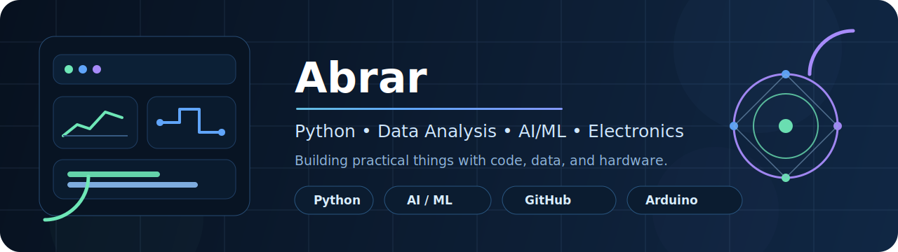

<h1 align="center">Hi 👋, I'm Abrar</h1>

  

  

---

## 💫 About Me

🔭 **I’m currently working on**
- Python-based data analysis and problem solving  
- Exploring AI/ML concepts and implementations  
- Building and maintaining projects on GitHub  
- Hands-on electronics and Arduino practice  

👯 **I’m looking to collaborate on**
- AI/ML and data analysis projects  
- Open-source contributions on GitHub  
- Beginner to intermediate research work  

🤝 **I’m looking for help with**
- Improving ML model building and optimization  
- Understanding real-world data pipelines  
- Writing clean, scalable code for projects  

🌱 **I’m currently learning**
- Machine Learning fundamentals  
- Data analysis with NumPy, Pandas, and visualization  
- Git and GitHub workflows  
- Arduino and basic embedded systems  

💬 **Ask me about**
- Python and data analysis basics  
- AI/ML learning paths  
- GitHub and project building  
- Electronics and Arduino  

⚡ **Fun fact**
- I enjoy turning ideas into small practical projects  
- Always learning something new 🚀  

---

## 🌐 Connect With Me

  
  
  

---

## 💻 Tech Stack

  

  
  
  

---

## 📊 GitHub Stats

  
  

  

---

## 🏆 Achievements

  

---

## 📈 Contribution Activity

  

---

## 🔝 Top Contributed Repo

  

---

  

